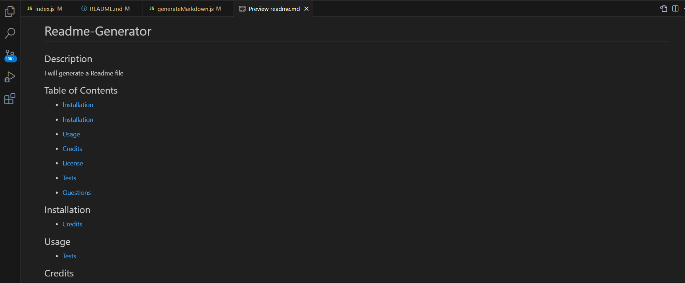

# README-Generator

## Description

ReadME-Generator is a website application, developed to generate a ReadME file for any project by prompting series of questions to save time for users .

## Technologies Used

-JavaScript
-Node.js
-NPM

## Usage
  
   

## Link to Github Repository

https://github.com/saveetha17/README-Generator.git

## Link to Deployed Application

https://saveetha17.github.io/README-Generator/

## Link to Screencastify Video

https://drive.google.com/file/d/1eeu7XHrRIH1UVZOakwre-JStgswhY6PR/view

